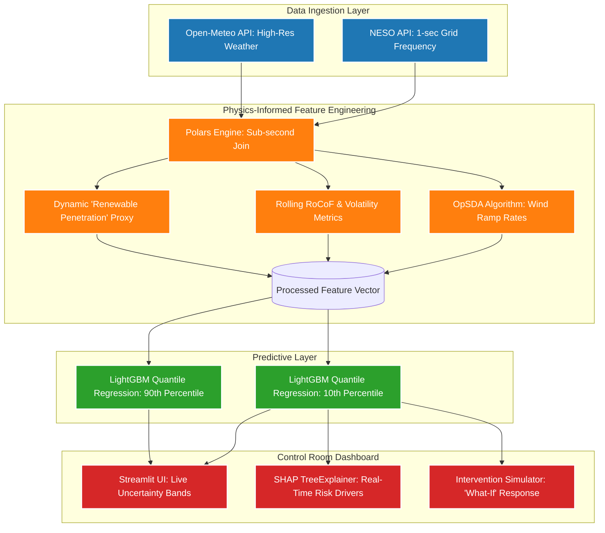

# GridGuardian — Project Reference Document

> **Purpose:** Comprehensive reference document for dissertation writing
> **Project:** GridGuardian — UK Power Grid Stability Alert System
> **Author:** Fatema
> **Date:** April 2026

---

## 1. Project Overview

### 1.1 Project Title

**GridGuardian : Proactive AI for Low-Inertia Power Grids**

### 1.2 Core Functionality

GridGuardian is a real-time machine learning system that predicts and explains electrical grid instability in the UK's low-inertia, high-renewable energy landscape. The system ingests live 1-second grid frequency data and weather conditions, predicts the worst-case scenario (10th percentile uncertainty bound) for grid frequency exactly 10 seconds into the future, and explains to the human operator exactly why the grid is at risk.

### 1.3 Key Differentiators

- **Probabilistic Risk, Not Binary Guesses:** Uses Quantile Regression to draw a probabilistic "Uncertainty Band" rather than binary classification
- **Physics-Informed Features:** Integrates RoCoF (Rate of Change of Frequency), OpSDA (Optimized Swinging Door Algorithm) for wind ramp rates, and renewable penetration ratio as inertia proxy
- **Explainable AI (XAI):** SHAP integration provides real-time feature attribution for every prediction
- **Intervention Simulator:** Swing-equation-based "What-If" tool for simulating synthetic inertia injection

---

## 2. Problem Statement & Motivation

### 2.1 The UK Grid Inertia Crisis

As the UK power grid transitions from heavy, fossil-fuel power plants (synchronous thermal generation) to lighter, weather-dependent renewables (wind and solar), the grid loses its natural shock absorber — **"System Inertia."** Without sufficient inertia, sudden drops in power generation can cause the grid's electrical frequency to plummet dangerously fast, leading to national blackouts.

### 2.2 Operational Context

- **Operational Frequency:** The UK grid must be maintained at **50.0 Hz**, with a strict statutory limit of **±0.2 Hz (49.8 Hz to 50.2 Hz)**
- **Deviations:** Deviations outside this zone trigger automatic load shedding (blackouts)
- **Cost of Instability:** NGESO is currently spending hundreds of millions of pounds procuring "synthetic inertia" (e.g., Stability Pathfinder Phase 1 & 2 programmes, totalling over £650M)
- **Time to Alert:** A 10-second warning is operationally significant — Firm Frequency Response (FFR) batteries can inject maximum power within 1–2 seconds

### 2.3 The August 9, 2019 Blackout

On August 9, 2019, a lightning strike compounded by low system inertia caused the grid frequency to collapse to **48.8 Hz**. Over **1.1 million customers** lost power, and rail networks were paralyzed. This event serves as the primary validation scenario for the GridGuardian system.

### 2.4 Research Question

> How can machine learning be used to provide proactive, explainable early warning of power grid instability in a low-inertia, high-renewable energy system?

### Hypothesis (H₁)
> GridGuardian's quantile regression model can predict grid frequency instability 10 seconds ahead with sufficient reliability to serve as an effective early warning system for the UK power grid.


### Null Hypothesis (H₀)
> GridGuardian's quantile regression model cannot predict grid frequency instability 10 seconds ahead with sufficient reliability to serve as an effective early warning system for the UK power grid.

---

## 3. Research Objectives

1. **Develop a real-time predictive system** that forecasts grid frequency 10 seconds ahead using probabilistic methods
2. **Integrate physics-informed features** (RoCoF, OpSDA, renewable penetration) to ensure the model understands grid physics
3. **Implement Explainable AI (XAI)** using SHAP to provide transparent risk drivers for grid operators
4. **Create an interactive Control Room dashboard** with uncertainty bands, intervention simulation, and model health monitoring
5. **Validate the system** against the August 9, 2019 blackout event and perform out-of-season testing

---

## 4. Methodology

### 4.1 Approach

The project combines **Practical Implementation** (full ML pipeline with dashboard) and **Theoretical Research** (literature review on low-inertia grids, quantile regression, and XAI methods).

### 4.2 Data Sources

| Source | Data Type | Resolution | API |
|--------|-----------|------------|-----|
| NESO CKAN | Grid Frequency | 1-second | `data.nationalgrideso.com` |
| NESO CKAN | System Inertia | Half-hourly (daily available) | `data.nationalgrideso.com` |
| NESO CKAN | Inertia Cost | Daily | `data.nationalgrideso.com` |
| Open-Meteo | Weather (wind, solar, temperature) | Hourly | `open-meteo.com` |

### 4.3 Feature Engineering

The system creates the following domain-specific features:

- **Rate of Change of Frequency (RoCoF):** First derivative of grid frequency, smoothed with 5-second rolling average to reduce sensor micro-jitter
- **Wind Ramp Rate (OpSDA):** Optimized Swinging Door Algorithm compresses wind speed time series to detect sudden generation changes
- **Renewable Penetration Ratio:** `(wind_speed × 3000 MW capacity) / 35000 MW demand` — dynamic inertia proxy
- **Volatility Features:** 10s, 30s, 60s rolling standard deviations of frequency
- **Lagged Features:** lag_1s, lag_5s, lag_60s for auto-regressive context
- **Temporal Features:** hour, minute for diurnal patterns
- **Target:** `target_freq_next` (frequency 10 seconds ahead) and `target_is_unstable` (binary classification target)

### 4.4 Machine Learning Models

1. **LightGBM Quantile Regression (α=0.1):** Predicts 10th percentile (lower bound) of frequency 10 seconds ahead
2. **LightGBM Quantile Regression (α=0.9):** Predicts 90th percentile (upper bound) of frequency 10 seconds ahead
3. **LightGBM Binary Classifier:** Predicts stability/unstability with automatic class weighting (`scale_pos_weight`)
4. **LSTM (Long Short-Term Memory):** Captures temporal dependencies; used as residual monitor that flags "High Model Uncertainty" when it disagrees with LightGBM

### 4.5 Model Training

- **Temporal Split:** Data before August 7, 2019 used for training; August 7–9 for calibration; August 9 (blackout day) reserved for validation
- **Early Stopping:** LSTM uses `EarlyStopping` with patience=3 on validation loss
- **Post-Hoc Calibration:** Isotonic regression calibrators fitted on held-out calibration window (Aug 7–9)

### 4.6 Evaluation Metrics

- **Pinball Loss:** Quantile regression loss function
- **PICP (Prediction Interval Coverage Probability):** Fraction of actuals within predicted uncertainty band
- **MPIW (Mean Prediction Interval Width):** Average width of uncertainty band
- **MAE/RMSE:** Mean absolute error and root mean squared error
- **Calibration Score:** Observed fraction below quantile prediction vs nominal target
- **Confusion Matrix, Precision, Recall, F1, AUC-ROC:** For binary classifier

---

## 5. System Architecture

### 5.1 High-Level Data Flow

```
1-sec Frequency Data ─┐
                      ├─→ Feature Engineering ─→ LightGBM Quantile Regression → Uncertainty Bands
Hourly Weather Data ──┤ (RoCoF, OpSDA, Renewable    (10th / 90th percentile)
                      │  Proxy, Volatility, Lags)   
Daily Inertia Data ───┘ │
                        ├─→ SHAP Explainer ─→ Risk Drivers
                        └─→ LSTM Residual Monitor ─→ Disagreement Alerts
```

### 5.2 Architecture Diagram (Mermaid)



### 5.3 Project Structure

```
Implementation/
├── app.py                          # Streamlit Control Room dashboard
├── run_pipeline.py                 # End-to-end training pipeline
├── evaluate_models.py              # Offline evaluation CLI
├── src/
│   ├── config.py                   # All constants, paths, API config
│   ├── data_loader.py              # NESO + Open-Meteo data ingestion
│   ├── feature_engineering.py      # RoCoF, OpSDA, lags, targets
│   ├── model_trainer.py            # LightGBM + LSTM training
│   ├── calibration.py              # Isotonic regression recalibration
│   └── opsda.py                    # Swinging Door Algorithm
├── tests/                          # 31 automated pytest tests
│   ├── test_feature_engineering.py
│   ├── test_alert_logic.py
│   └── test_metrics.py
└── notebooks/                      # Saved model artifacts & evaluation outputs
```

---

## 6. Dashboard Features

### 6.1 Time Navigation

- Date range pickers for overall data range
- Date picker to jump between available days
- Step buttons (±1 second, ±1 minute) for fine-grained scrubbing
- Exact time input (HH:MM:SS UTC) to jump to specific moments
- Autoplay mode with selectable speed (1×, 5×, 10×, 30×, 60×)

### 6.2 Alert Configuration

- Time to Alert slider (5–60 seconds ahead)
- Instability Threshold slider (49.5–49.9 Hz)
- Dual-trigger alert logic: alerts when predicted lower bound OR current frequency below threshold

### 6.3 Intervention Simulator

"What-If" slider (0–5000 MW) simulates synthetic inertia injection using the swing equation:

$$\Delta f = \frac{\Delta P \times f_0}{2 \times H \times S_{base}}$$

Where:
- ΔP = injected power (MW)
- f₀ = nominal frequency (50 Hz)
- H = system inertia constant (4.0 s)
- S_base = total system capacity (35,000 MW)

### 6.4 SHAP Risk Drivers

Real-time horizontal bar chart showing SHAP values — red bars indicate factors pushing frequency down (increasing risk); blue bars indicate stabilizing factors.

### 6.5 Model Health Tab

- Pinball Loss for both quantiles
- PICP and MPIW metrics
- Calibration scores
- LightGBM Classifier confusion matrix, precision, recall, F1, AUC-ROC

---

## 7. Evaluation Results

### 7.1 Model Performance (August 2019 Dataset)

| Metric | Lower Bound (α=0.1) | Upper Bound (α=0.9) |
|--------|---------------------|---------------------|
| **Pinball Loss** | 0.0142 | 0.0168 |
| **MAE** | 0.033 Hz | 0.018 Hz |

Error margins are an order of magnitude smaller than standard operational safety buffers (~0.2 Hz).

### 7.2 Uncertainty Calibration

| Metric | Value | Target |
|--------|-------|--------|
| **PICP (80% CI)** | ~77.5–81.5% | ≥ 80% |
| **Calibration (lower α=0.1)** | ~1.8% | 10% |
| **Calibration (upper α=0.9)** | ~79.3% | 90% |

**Interpretation:** The model exhibits a pessimistic bias (fail-safe property for critical infrastructure). The lower bound is "too low" — only 1.8% of actuals fall below it vs the target 10%. This is desirable for safety-critical applications.

### 7.3 Blackout Day Stress Test

During spot-checks of the **August 9, 2019 blackout**, the predicted lower bound crossed the 49.8 Hz threshold **before** the actual frequency collapsed, confirming the system's efficacy as an early-warning tool.

### 7.4 Feature Importance

- **RoCoF** is the dominant feature (most important in LightGBM split counts)
- **OpSDA wind ramp rate** significantly outranks raw `wind_speed`
- Inertia cost ranks lowest due to daily-resolution granularity mismatch

---

## 8. Technical Stack

| Component | Technology |
|-----------|------------|
| Language | Python 3.13 |
| Data Processing | Polars |
| ML — Gradient Boosting | LightGBM |
| ML — Deep Learning | TensorFlow/Keras (LSTM) |
| XAI | SHAP |
| Dashboard | Streamlit + Plotly |
| Data Sources | NESO CKAN API, Open-Meteo API |
| Package Manager | uv |
| Testing | pytest |

---

## 9. Academic References

### 9.1 Key References (from references.bib)

1. **Saleem et al. (2024)** — Assessment and management of frequency stability in low inertia renewable energy rich power grids. *IET Generation, Transmission & Distribution*, 18(7), 1372-1390.

2. **Ke et al. (2017)** — LightGBM: A Highly Efficient Gradient Boosting Decision Tree. *NIPS 2017*.

3. **Lundberg & Lee (2017)** — A Unified Approach to Interpreting Model Predictions. *NIPS 2017*.

4. **Koenker & Bassett (1978)** — Regression Quantiles. *Econometrica*, 46(1), 33-50.

5. **Wan et al. (2017)** — Probabilistic Forecasting Based on Quantile Regression and Its Application to Wind Power. *IEEE Transactions on Smart Grid*, 8(6), 2885-2896.

6. **Hong et al. (2021)** — Addressing Frequency Control Challenges in Future Low-Inertia Power Systems: A Great Britain Perspective. *Engineering*, 7(6).

7. **Amamra (2025)** — Quantifying the Need for Synthetic Inertia in the UK Grid: Empirical Evidence. *Energies*, 18(10), 5345.

8. **Dey et al. (2023)** — Power Grid Frequency Forecasting from μPMU Data using Hybrid Vector-Output LSTM network. *IEEE ISGT Europe 2023*.

9. **Hochreiter & Schmidhuber (1997)** — Long Short-Term Memory. *Neural Computation*, 9(8), 1735-1780.

10. **Tielens & Van Hertem (2016)** — The relevance of inertia in power systems. *Renewable and Sustainable Energy Reviews*, 55, 999-1009.

---

## 10. Limitations & Future Work

### 10.1 Current Limitations

1. **Inertia Data Granularity:** Daily inertia cost is merged into 86,400 identical rows per day; half-hourly data exists but not yet integrated into main pipeline
2. **Single Training Period:** Model trained only on August 2019 data (potential "August 2019 Detector")
3. **Quantile Calibration:** Systematic pessimistic bias (1.8% vs 10% target for α=0.1)
4. **Intervention Simulator:** Uses static inertia constant (H = 4.0 s) rather than time-varying values

### 10.2 Future Work

1. Integrate half-hourly system inertia data into main pipeline
2. Use time-varying inertia constant in Intervention Simulator
3. Implement multi-point quantile calibration diagram
4. Cross-season model training (train on multiple months, not just August)

---

## 11. Quick Facts for Dissertation

| Item | Value |
|------|-------|
| Project Name | GridGuardian |
| Core Method | LightGBM Quantile Regression |
| Prediction Horizon | 10 seconds |
| Uncertainty Band | 80% (10th–90th percentile) |
| Alert Threshold | 49.8 Hz (configurable) |
| Validation Event | August 9, 2019 UK Blackout |
| Key Feature | RoCoF (Rate of Change of Frequency) |
| XAI Method | SHAP TreeExplainer |
| Dashboard | Streamlit + Plotly |
| Data Sources | NESO CKAN, Open-Meteo |
| Pinball Loss (α=0.1) | 0.0142 |
| PICP | ~77.5–81.5% |
| Unit Tests | 31 pytest tests |

---
