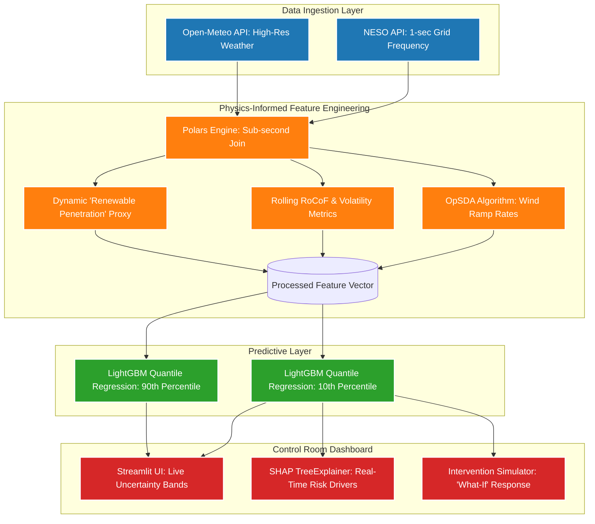

# GridGuardian v2: Proactive AI for Low-Inertia Power Grids

**Project Pitch & Roadmap for Supervisor Review**

---

## 1. Executive Summary: What is the Project?
As the UK power grid transitions from heavy, fossil-fuel power plants to lighter, weather-dependent renewables (wind and solar), the grid loses its natural shock absorber: **"System Inertia"**. Without inertia, sudden drops in power generation can cause the grid's electrical frequency to plummet dangerously fast, leading to national blackouts.

**GridGuardian v2** is a real-time, physics-informed Machine Learning prototype designed for the National Energy System Operator (NESO) Control Room. Rather than just reporting that a blackout is happening, the system acts as an early warning radar:
1.  **It Ingests** live, 1-second grid data and weather conditions.
2.  **It Predicts** the "worst-case scenario" (the 10th percentile uncertainty bound) for grid frequency exactly 10 seconds into the future.
3.  **It Explains** to the human operator exactly *why* the grid is at risk (e.g., "Wind power is dropping rapidly while grid inertia is critically low").

---

## 2. The Business Case: Why Power Grid Operators Care
The transition to Net-Zero is putting unprecedented strain on grid operators. This software provides massive operational value by shifting control rooms from *reactive* management to *proactive* risk mitigation.

### Key Facts & Figures:
*   **The Operational Limit:** The UK grid must be maintained at **50.0 Hz**, with a strict statutory limit of **±0.2 Hz (49.8 Hz to 50.2 Hz)**. Deviations outside this zone trigger automatic load shedding (blackouts).
*   **The Cost of Instability:** NGESO is currently spending hundreds of millions of pounds procuring "synthetic inertia" (e.g., through the Stability Pathfinder Phase 1 & 2 programs, totaling over £650M) to artificially stabilize the grid.
*   **The Risk of Failure (August 2019):** On August 9, 2019, a lightning strike compounded by low system inertia caused the grid frequency to collapse to 48.8 Hz. Over **1.1 million customers** lost power, and rail networks were paralyzed.
*   **Why 10 Seconds Matters:** A 10-second "Time to Alert" (TTA) might sound small to a human, but it is an eternity in power systems. Standard Firm Frequency Response (FFR) batteries can inject maximum power into the grid within **1 to 2 seconds**. A 10-second warning allows automated battery clusters and Demand Flexibility Services (DFS) to discharge *before* the frequency drops, preventing the crash entirely.

---

## 3. System Architecture
The system integrates domain-specific power engineering concepts with high-speed data science pipelines.

---

## 4. What Makes This Novel? (Showcase Differentiators)
*   **Not a Black Box:** Grid operators distrust AI they cannot understand. By integrating **SHAP (SHapley Additive exPlanations)** entirely into the live dashboard, the system doesn't just ring an alarm—it prints a diagnostic report (e.g., "Alert triggered: Negative Wind Ramp + Elevated RoCoF").
*   **Probabilistic Risk, Not Binary Guesses:** Standard academic models guess if a blackout will happen (True/False). This system uses **Quantile Regression** to draw a probabilistic "Uncertainty Band," allowing operators to visualize the worst-case 10% probability envelope.
*   **Physics-Informed Features:** The model utilizes the **Optimized Swinging Door Algorithm (OpSDA)** to isolate sudden physical jolts (ramp events) in wind generation, proving the model understands grid physics, not just numbers.

---

## 5. Development Roadmap & Checklist
To ensure the project is defensively sound against academic critique and stands out at a technological showcase, we are currently executing the following plan:

### ✅ Currently Completed (Phase 1 & 2)
- [x] Integrate live APIs (NESO Ckan, Open-Meteo).
- [x] Build asynchronous, high-speed data pipeline utilizing Polars.
- [x] Implement the Optimized Swinging Door Algorithm (OpSDA) for wind ramps.
- [x] Train baseline Gradient Boosting models (LightGBM).
- [x] Deploy Streamlit functional dashboard with live SHAP XAI integration.
- [x] Implement initial Quantile Regression for uncertainty banding.

### ⏳ In Progress / To Be Implemented (Phase 3 - The "Showcase Upgrades")
These items directly address academic critiques and add high-level "Prescriptive AI" capabilities:

- [ ] **Data Granularity Fix (High Priority):** Replace the static daily `inertia_cost` feature with a dynamic, physical proxy: the **Renewable Penetration Ratio** (`(1-second Wind Speed * Area Capacity) / Total MW Demand`). This proves the model uses scientifically valid, real-time physics.
- [ ] **The Intervention Simulator (Feature Addition):** Add a "What-If" slider to the dashboard allowing an operator to simulate injecting Synthetic Inertia (e.g., +500 MW from a Virtual Power Plant). The dashboard will dynamically recalculate and show the frequency bounds recovering.
- [ ] **RoCoF Smoothing (Model Stability):** Implement a Savitzky-Golay filter or a 2-second moving average on the RoCoF calculation to prevent sensor micro-jitter from triggering false ML alerts.
- [ ] **Reliability/Calibration UI Toggle:** Add a backend calculation for Pinball Loss to prove to judges that the 10th percentile band is mathematically calibrated across unseen testing data.
